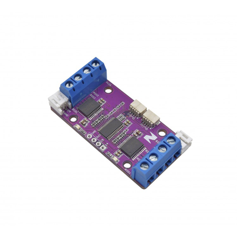

# Zio Qwiic 4 DC Motor Controller

> This product can be available for purchase [here](https://www.smart-prototyping.com/Zio-4-DC-Motor-Controller.html).

#### Description

Drive two motors at up to 1.2A of constant current with the Zio Bidirectional 4-Channel DC Motor Controller. Dual H-bridges will allow you to also brake and stop in addition to controlling the direction and speed of the motors. Two input signals (IN1 and IN2) can be used to control the motors with the following functions: CW, CCW, short-brake, and stop. 

You can independently control the two bidirectional DC motors at once. The PWM input allows you to spin the wheels in either direction and at whatever speed you like.

This board also comes equipped with Qwiic connectors so you can quickly and easily daisy-chain to other modules in the Qwiic ecosystem.

> Note: As with all of the Version 1.0 Zio Qwiic boards, this board has been produced with the I2C pull-ups disconnected by default. If there's a significant length of wire between this board and your MCU, you'll need to solder closed the solder jumpers (labeled SDA, 3v3 and SCL) to connect the pull-up resistors to VCC.

#### Specification

* Recommended motor voltage is 2.7 - 5.5V with a max of 15V (For full-current operation at higher voltages, add an appropriate heatsink to prevent triggering the thermal shutdown circuit and to keep the magic smoke inside those precious H-bridges)
* Output current continuous: 1A per channel
* Max. PWM Frequency: 100kHz
* Built-in Power Saving System
* Built-in Thermal Shutdown Circuit and Low Voltage Detecting Circuit
* IC: PCA9685
* I2C address: 0x40-0x7F (default: 0x40)
* Weight: 12.9g (0.45oz)
* Dimension: 54.2x27mm

#### Links

* [PCA9685PW datasheet](https://www.smart-prototyping.com/image/data/NOA-RnD/101897%204%20DC%20Motor%20Driver/PCA9685PW_datasheet.pdf)
* [TB6612FNG datasheet](https://www.smart-prototyping.com/image/data/NOA-RnD/101897%204%20DC%20Motor%20Driver/TB6612FNG_datasheet.pdf)
* [Adafruit PWM Servo Driver Library](https://github.com/adafruit/Adafruit-PWM-Servo-Driver-Library)
* [Demo Code (Solder the pull-up jumpers)](https://www.smart-prototyping.com/image/data/NOA-RnD/101897%204%20DC%20Motor%20Driver/Zio_4_DC_Motor_Controller.ino)
* [Eagle files](https://github.com/ZIOCC/Qwiic_4-Ch_DC_Motor_Controller)

> ###### About Zio
> Zio is a new line of open sourced, compact, and grid layout boards, fully integrated for Arduino and Qwiic ecosystem. Designed ideally for wearables, robotics, small-space limitations or other on the go projects. Check out other awesome Zio products [here](https://www.smart-prototyping.com/Zio).

> All Zio products are released under the [Creative Commons Attribution, Share-Alike License](https://creativecommons.org/licenses/by-sa/4.0/), and in accordance with the principles of the [Open Source Hardware Association's OSHW Statement of Principles 1.0 and OSHW Definition 1.0](https://www.oshwa.org/definition/).
